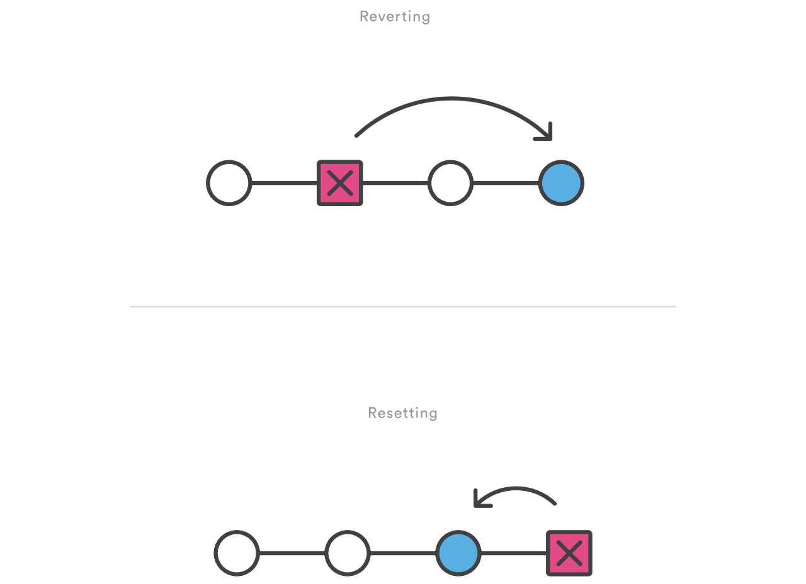

# 190830 github

### branch 관련 명령어

``` bash
$ git branch {브랜치명} #브랜치 생성
$ git checkout {브랜치명} #브랜치 이동
$ git branch -d {브랜치명} #브랜치 삭제
```

```bash
$ git branch checkout -b {브랜치명} #브랜치 생성 및 이동
```

```bash
$ git merge {브랜치명} #브랜치명을 지금 브랜치로 병합
(master) $ git merge feature/index #feature/index를 master에 병합
```


HEAD : 사용자가 지금 작업하고 있는 환경의 위치


## 상황 1. fast-foward

1. feature/test branch 생성 및 이동

   ```bash
   $ git checkout -b feature/test
   Switched to a new branch 'feature/test'
   (feature/test) $
   ```

2. 작업 완료 후 commit

   ```bash
   $ touch test.html
   $ git add .
   $ git commit -m 'Complete test.html'
   ```

3. master 이동

   ```bash
   $ git checkout master
   Switched to branch 'master'
   (master) $
   ```

4. master에 병합

   ```bash
   $ git merge feature/test
   Updating 446aded..56cd211
   Fast-forward
   ```

5. 결과 -> fast-foward (단순히 HEAD를 이동)

   * `master` 브랜치의 이력이 변화하지 않았기 때문! (`feature/test` 브랜치 생성 이후에 커밋이 추가되지 않음)

   ```bash
   $ git log --oneline
   56cd211 (HEAD -> master, feature/test) Complete test.html
   ```

6. branch 삭제

   ```bash
   $ git branch -d feature/test
   Deleted branch feature/test (was 56cd211).
   ```

---

## 상황 2. merge commit

1. feature/signout branch 생성 및 이동

   ```bash
   $ git checkout -b feature/signout
   ```

2. 작업 완료 후 commit

   ```bash
   $ touch signout.html
   $ git add .
   $ git commit -m 'Complete signout.html'
   ```

3. master 이동

   ```bash
   $ git checkout master
   ```

4. *master에 추가 commit 이 발생시키기!!*

   * 다른 branch에서 작업하지 않은 파일 수정 해주세요!

     ```bash
     $ touch .gitignore
     $ git add .
     $ git commit -m 'Add .gitignore'
     ```

5. master에 병합

   ```bash
   $ git merge feature/signout
   ```

6. 결과 -> 자동으로 *merge commit 발생*

   ```
   Merge branch 'feature/signout'
   
   # Please enter a commit message to explain why this merge is necessary,
   # especially if it merges an updated upstream into a topic branch.
   #
   # Lines starting with '#' will be ignored, and an empty message aborts
   # the commit.
   
   ```

   * Vim으로 열림! 
   * 메시지 수정하고자 하면 `i` 로 편집모드를 통해 수정하고
   * `esc` + `:` + `wq` 를 통해서 저장 및 종료
     * w : write
     * q : quit

   ```bash
   hint: Waiting for your editor to close the filMerge made by the 'recursive' strategy.
    signout.html | 0
    1 file changed, 0 insertions(+), 0 deletions(-)
    create mode 100644 signout.html
   
   ```

7. 그래프 확인하기

   ```bash
   $ git log --oneline --graph
   *   c914a02 (HEAD -> master) Merge branch 'feature/signout'
   |\
   | * e5de8e9 (feature/signout) Complete signout.html
   * | e945f5e Add .gitignore
   |/
   * 56cd211 Complete test.html
   
   ```

8. branch 삭제

   ```bash
   $ git branch -d feature/signout
   ```

   

## 상황 3. merge commit 충돌

1. feature/board branch 생성 및 이동

   ```bash
   $ git checkout -b feature/board
   ```

   

2. 작업 완료 후 commit

   * `.gitignore` 수정

     ```bash
     $ vi .gitignore
     $ git add .
     $ git commit -m 'Edit .gitignore'
     ```

   

3. master 이동

   ```bash
   $ git checkout master
   ```

   

4. *master에 추가 commit 이 발생시키기!!*

   - 다른 branch에서 작업한 파일을 같이

   - `.gitignore` 수정

     ```bash
     $ vi .gitignore
     ```

     

   

5. master에 병합

   ```bash
   $ git merge feature/board
   ```

   

6. 결과 -> *merge conflict발생*

   ```bash
   $ git merge feature/board
   Auto-merging .gitignore
   CONFLICT (content): Merge conflict in .gitignore
   Automatic merge failed; fix conflicts and then commit the result.
   (master|MERGING) $
   ```

   

7. 충돌 확인 및 해결

   ```bash
   <<<<<<< HEAD
   *.xlsx
   =======
   *.csv
   >>>>>>> feature/board
   ```

   * 충돌 mark 를 확인하여, 코드를 알맞게 수정한다!
   * `git status` 명령어 통해서 어느 파일이 충돌인지 확인한다.

   

8. merge commit 진행

   ```bash
   $ git add .
   $ git commit
   ```

   * commit 메시지는 미리 작성되어 있다!

   

9. 그래프 확인하기

   ```bash
   $ git log --oneline --graph
   ```

   

10. branch 삭제

    ```bash
    $ git branch -d feature/board
    ```


--------------------------

## stash - 임시공간

> 작업 중에 작업이 완료되지 않아서 커밋을 하기 애매한 상황에서 임시적으로 현재의 변경사항을 저장할 수 있는 공간이 있다.

1. 현재 작업 파일 stash로 이동

   - `working directory` 작업 이력을 `stash`로 이동시킨다.

     ```bash
     $ git stash
     ```

2. `working directory`에 반영

   - 다시 작업 이력을 불러온다.

     ```bash
     $ git stash pop
     ```

   - 위의 명령어는 아래의 두 개의 명령어를 실행시키는 것과 동일하다.

     ```bash
     $ git stash apply # 불러오기
     $ git stash drop # 삭제하기
     
     $ git stash pop # apply + drop
     ```

3. `stash` 확인

   ```bash
   $ git stash list
   ```

----

## Reset  vs  Revert

### 1. Reset

> 특정 시점의 이력으로 되돌릴 수 있다.

1. 특정 시점 + 변경사항을 Staging Area에 둔 상태로

```bash
$ git reset {커밋해시코드}
```

2. 특정 시점

```bash
$ git reset --hard {커밋해시코드}
```

- `Working Directory`에 기존의 변경사항을 남겨주지 않아서 반드시 사용할 때 조심해야 한다.

### 2. Revert

> 특정 시점의 이력으로 돌아갔다는 커밋과 함께 되돌릴 수 있다.

```bash
$ git revert {커밋해시코드}
```





- Master Branch : 계속해서 운영되고 있는 코드

- Develop Branch : 개발이 진행되고 있는 코드

- Feature Brance : Develop Branch 안에서 각각의 진행되는 코드


#완전 다른 사람의 프로젝트에 참여하기 위해서 Fork를 통해 참여할 수 있다.